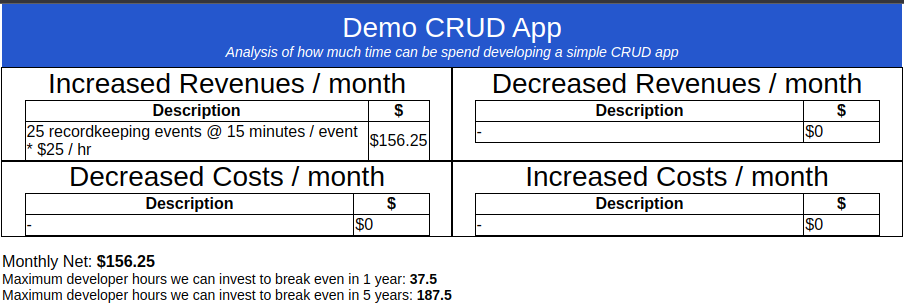

# Partial Budget Tool

This is a little toolkit for making partial budgets from a yaml file and python.

Example Input:

```yaml
---
name: Demo CRUD App
description: |
  Analysis of how much time can be spend developing a simple CRUD app
developer_hourly_rate: 50
increased_revenues:
  - label: 25 recordkeeping events @ 15 minutes / event * $25 / hr
    value: { { 25 * (15 / 60) * 25 } }
decreased_revenues:
  - label: "-"
    value: 0
decreased_costs:
  - label: "-"
    value: 0
increased_costs:
  - label: "-"
    value: 0
```

Example Output:


